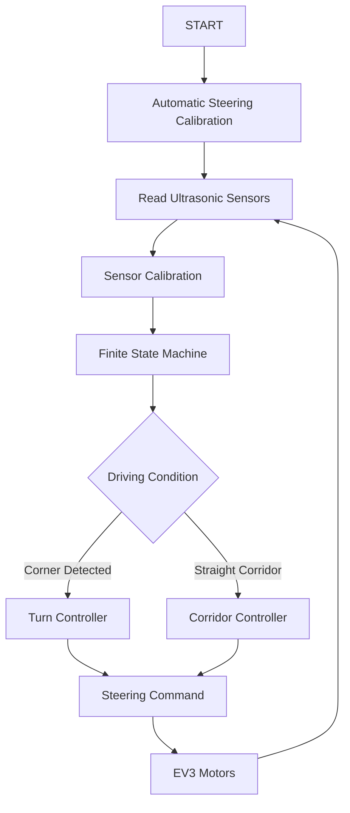
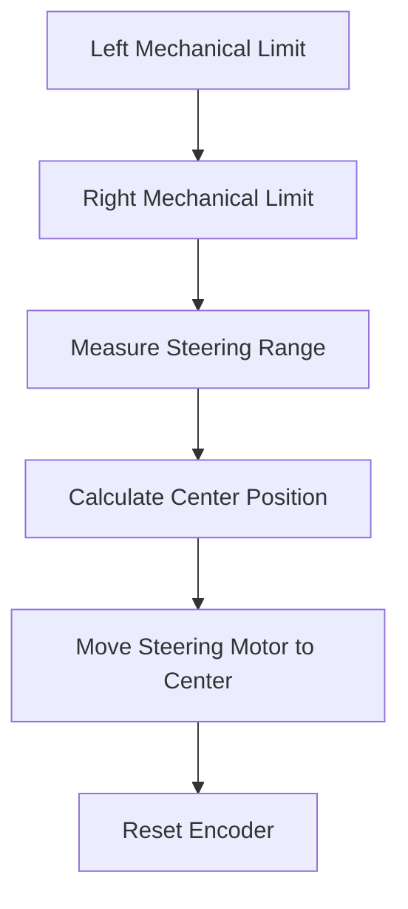
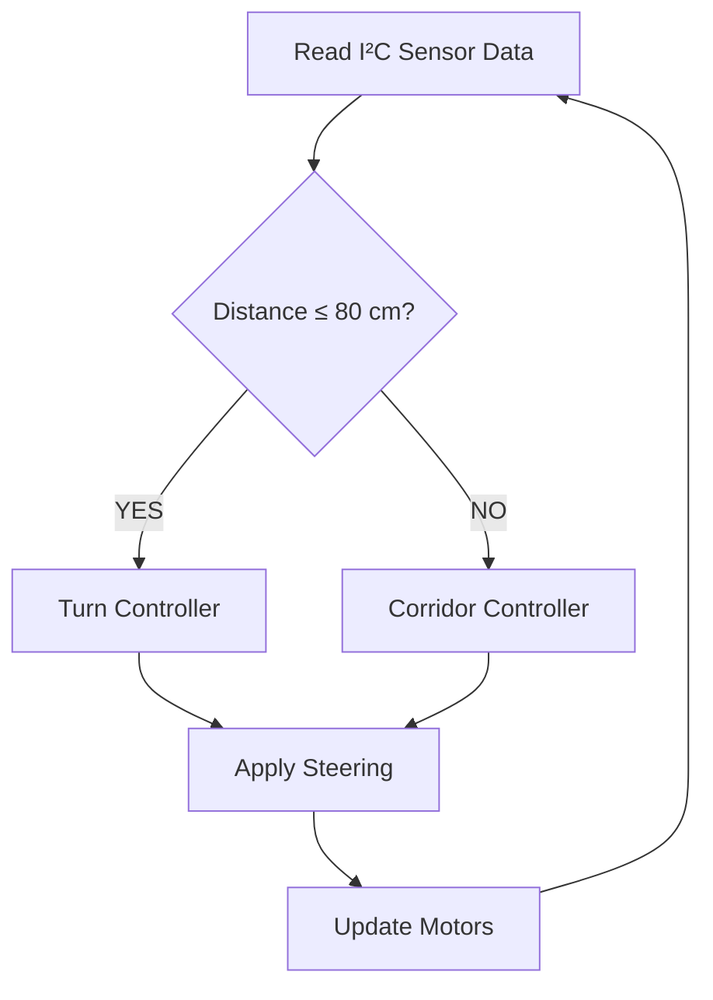
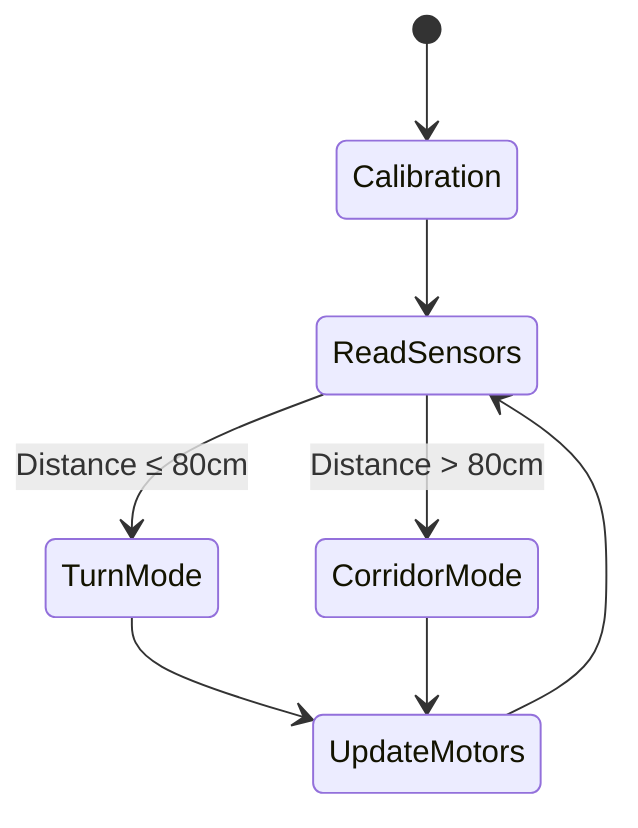

<div align="center">

# 🏎️ LOS GRISES JR
## World Robot Olympiad 2026  
### Future Engineers Category

<br>


<br>

---

# 📷 Final Competition Robot

**Insert final robot hero image here**

*(Recommended image: front three-quarter view showing the complete vehicle)*

---

### Official Engineering Repository

Documentation of Team Los Grises Jr's autonomous vehicle developed for:
**World Robot Olympiad 2026 — Future Engineers Category**

<p align="center">
  
</p>

---

</div>


# 🚗 Project Overview

Our robot is a fully autonomous four-wheel vehicle designed for the **World Robot Olympiad 2026 Future Engineers competition**.

The objective of this project is to develop a reliable autonomous vehicle capable of navigating the competition environment through a combination of:

- Mechanical engineering.
- Embedded electronics.
- Autonomous control algorithms.
- Sensor processing.
- Software architecture.
- Iterative testing and optimization.


The final platform combines:

| System | Implementation |
|:---|:---|
| Steering | Ackermann steering geometry |
| Drive System | Rear-wheel drive |
| Main Controller | LEGO Mindstorms EV3 Brick |
| Coprocessor | Arduino Nano |
| Vision System | HuskyLens AI Camera |
| Distance Measurement | Five ultrasonic sensors |
| Communication | I²C protocol and UART protocol |
| Electronics | Custom-designed PCB |
| Control Algorithm | Adaptive Dual PD Controller |
| Decision System | Finite State Machine |


---

# ⚡ Quick System Overview

<div align="center">

```
                 ┌──────────────────┐
                 │ HuskyLens Camera │
                 └────────┬─────────┘
                          │
                          ▼

┌────────────────┐    ┌──────────────┐
│ Ultrasonic     │───▶│ Custom PCB   │
│ Sensors (x5)   │    └──────┬───────┘
└────────────────┘           │
                             ▼

                      ┌────────────┐
                      │ Arduino    │
                      │ Nano       │
                      └─────┬──────┘
                            │
                          I²C
                            │
                            ▼

                    ┌──────────────┐
                    │ LEGO EV3     │
                    │ Controller   │
                    └──────┬───────┘
                           │

             ┌─────────────┴─────────────┐
             ▼                           ▼

      Steering Motor              Drive Motor

```

</div>


The robot uses a distributed architecture where each subsystem performs a specific role:

- The **Arduino Nano** manages sensor acquisition and communication.
- The **EV3 Brick** performs navigation decisions and motion control.
- The **Custom PCB** organizes power distribution and signal routing.
- The **software architecture** coordinates calibration, sensing, and autonomous driving.


---

# 📑 Table of Contents

- [👥 Team](#-team)
- [🚗 Project Overview](#-project-overview)
- [⚡ Quick System Overview](#-quick-system-overview)
- [⭐ Engineering Highlights](#-engineering-highlights)
- [📊 Robot Specifications](#-robot-specifications)
- [📸 Vehicle Gallery](#-vehicle-gallery)
- [🔩 Components and Hardware](#-components-and-hardware)
- [🛠 Mechanical Design](#-mechanical-design)
- [⚡ Electronics](#-electronics)
- [🔌 Custom PCB](#-custom-pcb)
- [💻 Software Architecture](#-software-architecture)
- [🎯 Steering Calibration](#-automatic-steering-calibration)
- [📡 Sensor Calibration](#-sensor-calibration)
- [🎮 Dual PD Controller](#-dual-pd-steering-controller)
- [🔄 Finite State Machine](#-finite-state-machine)
- [🧠 Engineering Decisions](#-engineering-decisions)
- [📈 Current Performance](#-current-performance)
- [🚀 Future Improvements](#-future-improvements)
- [📓 Engineering Journal](#-engineering-journal)
- [📂 Repository Structure](#-repository-structure)
- [🏁 Conclusion](#-conclusion)


---

# 👥 Team


## 📷 Team Photo

<div align="center">

**Insert official team photograph here**

</div>


---

# 👨‍💻 Renato Medina
<p align="center">

</p>

## Team Captain

| Information | Details |
|:---|:---|
| Age | 14 |
| Role | Team Captain and Programmer |
| Main Areas | Software, Embedded Systems, Integration |


### Responsibilities

- 💻 Software Development
- 🤖 Autonomous Navigation Algorithms
- ⚙️ Mechanical Design
- 🔧 Robot Integration
- 🧠 System Architecture
- 📚 Technical Documentation
- 🔌 Embedded Programming


---

### About Renato

Renato serves as the **Team Captain** and leads the software architecture, autonomous navigation development, project documentation, and system integration of the robot.

His robotics journey began through the **OnStage TMR program**, where he developed a strong interest in autonomous systems, embedded programming, and engineering design.

Since then, he has focused on combining:

- Software development.
- Electronics.
- Mechanical design.
- Control systems.

to create reliable robotic platforms.

For the WRO 2026 season, his objective is to develop a highly reliable autonomous vehicle while expanding his knowledge of embedded systems, control theory, and robotic engineering.

---

# 👩‍🔧 Paulina

## Mechanical & Electronics Designer


| Information | Details |
|:---|:---|
| Role | Mechanical & Electronics Designer |
| Main Areas | Assembly, Electronics, Testing |


### Responsibilities

- 🔩 Mechanical Assembly
- ⚡ Electronics Integration
- 🔌 PCB Installation
- 🧪 Robot Testing
- 📐 Structural Optimization
- 🛠 Cable Organization


---

### About Paulina

Paulina is responsible for the robot's mechanical construction and electronic integration.

Her work focuses on:

- Structural assembly.
- Sensor installation.
- PCB integration.
- Mechanical validation.
- Hardware reliability.


Her contributions have been fundamental in transforming the initial prototype into a competition-ready autonomous vehicle with improved stability and maintainability.


📷 **Insert Paulina working on assembly image here**


---

# 🤝 Team Responsibilities


| Area | Renato | Paulina |
|:---|:---:|:---:|
| Mechanical Design | ✅ | ✅ |
| Robot Assembly | ✅ | ✅ |
| Electronics Integration | | ✅ |
| PCB Installation | ✅ | ✅ |
| Software Development | ✅ | |
| EV3 Programming | ✅ | |
| Arduino Programming | ✅ | |
| Documentation | ✅ | ✅ |
| Testing & Validation | ✅ | ✅ |


---

# ⭐ Engineering Philosophy


> [!IMPORTANT]
>
> The development of Los Grises Jr is based on continuous engineering improvement.
>
> Every subsystem has been tested, analyzed, modified, and optimized with three main objectives:
>
> - Increase reliability.
> - Improve repeatability.
> - Simplify maintenance.


---

# ⭐ Engineering Highlights


The current robot incorporates multiple engineering improvements developed specifically for the **WRO Future Engineers Challenge**.


| Feature | Implementation |
|:---|:---|
| Steering System | Ackermann steering geometry |
| Drive System | Rear-wheel drive |
| Sensors | Five ultrasonic sensors |
| Vision | HuskyLens AI camera |
| Coprocessors | 2 Arduino Nano |
| Electronics | Custom PCB |
| Communication | I²C architecture |
| Steering Calibration | Automatic encoder-based calibration |
| Control | Adaptive Dual PD controller |
| Navigation | Finite State Machine |
| Software | Modular architecture |
| Sensor Mounting | Custom 3D printed supports |
| Mechanical Design | Optimized weight distribution |


---

<div align="center">

# 📊 Robot Specifications


<div align="center">

| Specification | Value |
|:---|:---|
| Competition | WRO Future Engineers 2026 |
| Robot Type | Autonomous Vehicle |
| Dimensions | 24 × 23 × 18 cm |
| Maximum Allowed Size | 30 × 30 × 30 cm |
| Steering System | Ackermann Steering |
| Drive System | Rear-Wheel Drive |
| Chassis | LEGO Mindstorms EV3 |
| Main Controller | LEGO EV3 Brick |
| Coprocessor | Arduino Nano |
| Vision System | HuskyLens AI Camera |
| Distance Sensors | Five Ultrasonic Sensors |
| Communication Protocol | I²C |
| Custom Electronics | Custom PCB |
| Sensor Supports | 3D Printed |
| Programming Languages | EV3-G & Arduino C++ |

</div>


---

# 📸 Vehicle Gallery


The following images show the final competition vehicle from different perspectives.

These photographs demonstrate:

- Mechanical construction.
- Sensor placement.
- Electronics integration.
- Cable organization.
- Overall vehicle design.


<div align="center">


| Front View | Top View | Right Side |
|:---:|:---:|:---:|
| 📷 | 📷 | 📷 |
| Insert image | Insert image | Insert image |


| Left Side | Rear View | Bottom View |
|:---:|:---:|:---:|
| 📷 | 📷 | 📷 |
| Insert image | Insert image | Insert image |


</div>


> [!NOTE]
>
> A demonstration video will be added after the final validation tests are completed.


---

# 🔩 Components and Hardware


The robot combines LEGO components with custom embedded electronics to create a modular and reliable autonomous platform.

Each component was selected according to:

- Reliability.
- Compatibility.
- Mechanical integration.
- Software requirements.
- Long-term maintainability.


| Component | Quantity | Function | Status |
|:---|:---:|:---|:---:|
| LEGO EV3 Brick | 1 | Main controller | ✅ |
| EV3 Large Motor | 1 | Rear-wheel traction | ✅ |
| EV3 Medium Motor | 1 | Ackermann steering | ✅ |
| Ultrasonic Sensors | 5 | Distance measurement | ✅ |
| Arduino Nano | 1 | Sensor acquisition and communication | ✅ |
| HuskyLens AI Camera | 1 | Vision processing | ✅ |
| Custom PCB | 1 | Power and signal distribution | ✅ |
| LEGO Wheels | 4 | Vehicle mobility | ✅ |
| 3D Printed Supports | Multiple | Sensor mounting | ✅ |


---

# 🛠 Mechanical Design


## Design Evolution


The mechanical structure of the robot was developed through multiple iterations focused on:

- Structural rigidity.
- Weight distribution.
- Driving stability.
- Maintenance accessibility.
- Competition compliance.


Rather than modifying only a single prototype, the robot evolved progressively through testing and engineering improvements.

Every redesign addressed specific limitations discovered during previous experiments.

The result is a compact autonomous vehicle designed for reliability and repeatability.


---

## 📷 Mechanical Design Overview


<div align="center">

**Insert chassis evolution image here**

</div>


---

# 📏 Final Dimensions


| Measurement | Value |
|:---|:---:|
| Length | 24 cm |
| Width | 23 cm |
| Height | 18 cm |


The final design remains within the official WRO Future Engineers limit of:

```
30 × 30 × 30 cm
```


The available internal space allows integration of:

- EV3 electronics.
- Arduino coprocessor.
- Custom PCB.
- Sensor wiring.
- Steering mechanism.


---

# ⚖️ Weight Distribution


Achieving a balanced center of gravity was one of the main mechanical objectives.


Instead of concentrating all components in one area, the mass was intentionally distributed throughout the chassis.


## Main Design Decisions


| Component | Position |
|:---|:---|
| EV3 Brick | Rear section |
| Drive Motor | Center area |
| Steering Motor | Above steering mechanism |
| Custom PCB | Near sensor assembly |
| Arduino Nano | Adjacent to PCB |


This configuration improves:

- Acceleration stability.
- Braking behavior.
- Cornering performance.
- Mechanical reliability.


---

# 🔄 Ackermann Steering System


The robot uses an Ackermann-inspired steering mechanism powered by an EV3 Medium Motor.


Unlike differential steering systems, Ackermann geometry allows the vehicle to follow more realistic turning trajectories by reducing tire slip.


## Steering Control Method


The steering motor is controlled using encoder positions instead of continuous rotation.


This provides:

✅ Repeatable steering angles  
✅ Faster response  
✅ Automatic steering centering  
✅ Reduced positioning error  


---

## Steering Protection


The software limits the maximum steering angle to prevent:

- Mechanical overtravel.
- Transmission stress.
- Unnecessary motor load.


---

# 🚗 Rear-Wheel Drive


The vehicle uses a rear-wheel-drive configuration powered by an EV3 Large Motor.


This architecture was selected because it provides several advantages:


| Advantage | Result |
|:---|:---|
| Better weight transfer | Improved acceleration |
| Independent steering system | Less interference |
| Simpler drivetrain | Increased reliability |
| Easier maintenance | Faster repairs |


Separating propulsion and steering makes vehicle behavior more predictable during autonomous navigation.


---

# 📡 Sensor Mounts


All ultrasonic sensors are installed using custom-designed 3D printed brackets.


<div align="center">

📷 **Insert sensor mount image here**

</div>


The supports were designed to:


- Maintain precise alignment.
- Reduce vibration.
- Improve rigidity.
- Simplify installation.
- Guarantee repeatable sensor positioning.


Compared with direct LEGO mounting, the printed supports significantly improve measurement consistency.


---

# ⚡ Electronics


The robot combines LEGO electronics with custom embedded hardware to create a modular electrical architecture.


The system is divided into two main processing units:


| Controller | Responsibility |
|:---|:---|
| LEGO EV3 Brick | Navigation, decision making, motor control |
| Arduino Nano | Sensor acquisition and communication |


This distributed architecture provides:

- Reduced wiring complexity.
- Lower EV3 port usage.
- Easier debugging.
- Better scalability.


---

# 🔌 Electronic Architecture


<div align="center">


```
          Ultrasonic Sensors
              │ │ │ │ │
              ▼ ▼ ▼ ▼ ▼

          ┌────────────┐
          │ Custom PCB │
          └─────┬──────┘
                │

          ┌────────────┐
          │ Arduino    │
          │ Nano       │
          └─────┬──────┘
                │
              I²C

                │

          ┌────────────┐
          │ LEGO EV3   │
          │ Brick      │
          └─────┬──────┘

                │

      Steering Motor + Drive Motor

```

</div>


The architecture separates:

- Sensor acquisition.
- Data communication.
- Decision making.
- Vehicle control.


This modular approach allows each subsystem to be tested independently.


---

# 🔌 Custom PCB


One of the most important improvements during development was the creation of a custom Printed Circuit Board.


During early testing, sensors were connected individually using loose wiring.

Although functional, this approach caused:


❌ Cable clutter  
❌ Difficult maintenance  
❌ Loose connections  
❌ Limited organization  


To solve these problems, a dedicated PCB was designed specifically for this robot.


---

## PCB Functions


The custom PCB provides:


| Function | Purpose |
|:---|:---|
| Power distribution | Organized electrical supply |
| Signal routing | Cleaner connections |
| Sensor interfaces | Easy sensor replacement |
| Arduino interface | Simplified communication |
| Cable management | Improved organization |


---

## PCB Advantages


Compared with individual wiring, the PCB provides:


✅ Cleaner internal organization  
✅ Faster assembly  
✅ Easier troubleshooting  
✅ Higher mechanical reliability  
✅ Reduced accidental disconnections  
✅ Better future expansion capability  


---

<div align="center">


**Software Architecture • Calibration Systems • Dual PD Controller • FSM • Engineering Decisions • Future Improvements • Repository Structure**

</div>

# 💻 Software Architecture


The robot software was designed using a **modular architecture**, where each subsystem has a specific responsibility.


Instead of implementing all functionalities inside a single program, the system is divided into independent modules for:

- Sensor acquisition.
- Calibration.
- Decision making.
- Motion control.
- Autonomous navigation.


This organization improves:

✅ Code readability  
✅ Debugging efficiency  
✅ Testing capability  
✅ Future expansion  


---

# 🧩 Software Execution Flow


<div align="center">




</div>


---

# ⚙️ Software Modules


| Module | Function |
|:---|:---|
| Sensor Acquisition | Reads ultrasonic sensors through Arduino Nano |
| Steering Calibration | Automatically centers steering mechanism |
| Sensor Calibration | Removes mechanical measurement offsets |
| Finite State Machine | Selects driving behavior |
| Turn Controller | Optimized PD control for corners |
| Corridor Controller | Optimized PD control for straight sections |
| Motion Controller | Controls speed and steering |
| Safety Functions | Prevents invalid commands |


---

# 🎯 Automatic Steering Calibration


Every autonomous run begins with an automatic steering calibration routine.


The objective is to guarantee that every attempt starts from the same steering reference position.

Instead of manually aligning the steering system, the robot automatically determines the mechanical limits using the motor encoder.


---

## Calibration Process





---

## Advantages


The calibration system provides:


✅ Consistent steering position  
✅ Improved repeatability  
✅ Elimination of manual adjustments  
✅ Reduced steering errors  
✅ Better autonomous accuracy  


After calibration, the steering encoder is reset to zero and becomes the reference point for all future commands.


---

# 📡 Sensor Calibration


Even identical ultrasonic sensors may produce small differences due to:

- Manufacturing tolerances.
- Mechanical positioning.
- Assembly variations.


To compensate for these differences, the robot performs an automatic sensor calibration routine at startup.


---

## Sensor Offset Calculation


The robot measures the difference between the left and right sensors while positioned approximately in the center of the track.


### Offset:

```text
offset = Right Sensor - Left Sensor
```


During operation, this value is removed from the steering error calculation.


### Corrected Error:

```text
error = (Right Distance - Left Distance) - Offset
```


---

## Benefits


This calibration improves:


✅ Lane-centering accuracy  
✅ Sensor consistency  
✅ Repeatability after maintenance  
✅ Control stability  


---

# 🎮 Adaptive Dual PD Steering Controller


The steering system uses a closed-loop **Proportional-Derivative controller**.


Instead of using only one controller configuration, the robot uses two different PD controllers depending on the driving situation.


The active controller is selected automatically according to the environment.


---

# Controller Selection





---

# 🔄 Turn Controller


When the robot detects that it is approaching a corner, it enters Turn Mode.


The controller prioritizes smooth cornering while maintaining speed.


| Parameter | Value |
|:---|:---:|
| KP | 1.6 |
| KI | 0.0 |
| KD | 0.2 |
| Forward Speed | 65 |
| Steering Limit | ±20 |


---

# ➡️ Corridor Controller


When the robot is inside a long corridor, lane-centering accuracy becomes the priority.


| Parameter | Value |
|:---|:---:|
| KP | 3.0 |
| KI | 0.0 |
| KD | 0.2 |
| Forward Speed | 35 |
| Steering Limit | ±40 |


---

# Control Equation


The steering correction is calculated using:


```text
error = (right_distance - left_distance) - sensor_offset

derivative = error - previous_error

output = (KP × error) + (KD × derivative)
```


The integral term is intentionally disabled because ultrasonic sensors naturally produce small variations that could accumulate over time.


---

# 🔄 Finite State Machine (FSM)


The robot navigation system is organized around a Finite State Machine.


The FSM allows the robot to change behavior according to the current environment.


---

# FSM Diagram





---

## FSM Advantages


The FSM architecture provides:


✅ Clear software organization  
✅ Easier debugging  
✅ Independent controller development  
✅ Future expansion capability  


Future states can include:


- Obstacle avoidance.
- Vision-based navigation.
- Dynamic speed control.
- Advanced sensor fusion.


---

# 🧠 Engineering Decisions


Every major engineering decision was based on testing, analysis, and continuous improvement.


| Decision | Reason | Benefit |
|:---|:---|:---|
| Ackermann Steering | More realistic vehicle geometry | Smoother turns |
| Rear-Wheel Drive | Separates propulsion and steering | Better reliability |
| Encoder Steering | Absolute position control | Repeatable angles |
| Five Ultrasonic Sensors | Increased environmental awareness | Better perception |
| Arduino Nano Coprocessor | Dedicated sensor processing | Reduced EV3 workload |
| I²C Communication | Single communication channel | Cleaner architecture |
| Custom PCB | Organized electronics | Improved maintenance |
| 3D Printed Mounts | Fixed sensor position | Better measurements |
| Modular Software | Independent modules | Easier development |
| Dual PD Controller | Adaptive driving behavior | Better stability |


---

# 📈 Current Performance


Current testing demonstrates that the robot provides reliable autonomous behavior.


Achievements:


✅ Stable lane-centering  
✅ Smooth steering corrections  
✅ Automatic steering calibration  
✅ Consistent multi-run performance  
✅ Stable Arduino-EV3 communication  
✅ Improved electrical reliability after PCB integration  
✅ Strong mechanical structure for repeated testing  


The current platform provides a reliable foundation for completing future competition objectives.


---

# 🚀 Future Improvements


Although the current robot already provides a strong foundation, several improvements are planned.


## Planned Development


- Complete Obstacle Challenge implementation.
- Full HuskyLens integration.
- Dynamic speed controller.
- Expanded FSM architecture.
- Sensor fusion techniques.
- Improved obstacle avoidance.
- Further steering optimization.
- Additional mechanical improvements.
- Final cable management refinement.


The modular architecture allows these improvements to be implemented without redesigning the complete system.


---

# 📓 Engineering Journal


The complete engineering process is documented in a dedicated engineering journal.


The journal includes:


- Mechanical iterations.
- Hardware modifications.
- Software development.
- Testing procedures.
- Engineering decisions.
- Performance analysis.


📄 Engineering Journal:

```
docs/engineering_journal.md
```


---

# 📂 Repository Structure


```text
.
├── docs
│   ├── engineering_journal.md
│   ├── mechanical_design.md
│   ├── electronics.md
│   └── software.md
│
├── images
│   ├── robot
│   ├── pcb
│   ├── team
│   └── development
│
├── models
│   ├── chassis.stl
│   ├── sensor_mount.stl
│   └── pcb
│
├── src
│   ├── EV3-G
│   ├── Arduino
│   └── Pseudocode
│
└── README.md

```


---

# 📅 Development Timeline


| Date | Milestone |
|:---|:---|
| 4 Jul 2026 | Initial PD controller prototype |
| 8 Jul 2026 | PCB manufacturing |
| 10 Jul 2026 | PCB assembly and testing |
| 13 Jul 2026 | FSM implementation |
| 21 Jul 2026 | I²C communication completed |
| 27 Jul 2026 | Final hardware integration |
| 28 Jul 2026 | Final robot assembly |


---

# 🙏 Acknowledgements


We would like to thank our mentors, teachers, and everyone who supported the development of this project throughout the WRO 2026 season.


Their guidance, technical advice, and encouragement were essential in transforming an initial concept into a functional autonomous vehicle.


---

# 🏁 Conclusion


The current version of the **Los Grises Jr autonomous vehicle** represents the result of an iterative engineering process involving:

- Mechanical design.
- Electronics development.
- Embedded programming.
- Control theory.
- Autonomous navigation.


Compared with the earliest prototypes, the final platform incorporates:


✅ Custom-designed PCB  
✅ Arduino Nano coprocessor  
✅ Ackermann steering system  
✅ Automatic steering calibration  
✅ Adaptive Dual PD controller  
✅ Modular software architecture  
✅ Improved mechanical reliability  


The project continues evolving toward the completion of the remaining WRO challenges while maintaining the engineering principles that guided the entire development process:


> **Reliability, repeatability, and continuous improvement.**


---

<div align="center">

# 🏎️ Team Los Grises Jr

## World Robot Olympiad 2026  
## Future Engineers Category

</div>
