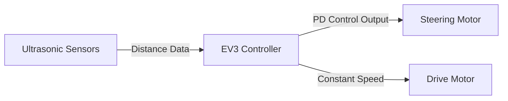

## This repository contains the official documentation of Team **"Los Grises Jr"** for the Future Engineers category at the World Robot Olympiad 2026.

<p align="center">
  
</p>

---

## Team Photo


---
## Team Members

### Renato Medina

<p align="center">

</p>

**Role:** Programmer and Captain

I started two years ago in elementary school at OnStage TMR, which sparked my interest in robotics. In this competition, my goal is to become a more well-rounded programmer.

**Age:** 14

---

## Project Overview

This project presents the development of an autonomous vehicle for the Future Engineers category of the World Robot Olympiad 2026.

The robot currently focuses on the **Open Challenge**: navigating the track using ultrasonic distance sensors and a closed-loop PD controller for steering.

The system integrates:

- Ultrasonic-based lane centering
- A dedicated steering motor with automatic calibration
- PD-based control for smooth, accurate trajectory tracking

The Obstacle Challenge subsystem (computer vision with a HuskyLens camera and Arduino Nano) is in earlier development and documented separately below as **planned/in progress**.

---

## Vehicle Photo

<div align="center">


| Top | Right | Left |
| :---: | :---: | :---: |
|  |  |  |
| **Bottom** | **Rear** | |
|  |  | |


---

## Components and Hardware

| Component | Description | Status |
|-----------|-------------|--------|
| **45544 LEGO MINDSTORMS Education EV3 Core Set** | Forms the chassis, drive motor, and steering motor. Controlled via `ev3dev2`. | **In use** |
| **5x Ultrasonic Sensors** | Mounted on the sides of the chassis for lane centering (left/right wall distance). | **In use** |
| **Arduino Nano** | ATmega328-based microcontroller, planned for vision processing. | Planned (Obstacle Challenge) |
| **DFRobot HuskyLens AI Camera** | AI vision sensor for detecting colored obstacles. | Planned (Obstacle Challenge) |

---

## Open Challenge: Control System

### Steering Mechanism

Steering is controlled by a dedicated `MediumMotor`, operated via absolute encoder positions rather than continuous rotation. This allows precise, repeatable steering angles relative to a calibrated center.

### Automatic Steering Calibration

Because the steering motor's "center" position can vary between runs (depending on how the wheels were last left), the robot performs an automatic calibration routine at startup:

1. The steering motor drives left until it reaches its mechanical limit.
2. The steering motor drives right until it reaches its opposite mechanical limit.
3. The total range of motion is measured, and the mathematical center is calculated.
4. The motor moves to this calculated center and resets its encoder count to zero, establishing it as the new reference point.

This ensures consistent, centered steering at the start of every run without manual adjustment.

### Sensor Offset Calibration

At startup, both ultrasonic sensors take an initial reading while the robot is assumed to be centered on the track. The difference between the left and right readings is stored as an **offset** and subtracted from the error in every control loop. This compensates for small asymmetries in sensor placement or mounting.

### PD Control for Lane Centering

The robot maintains its position in the lane using a PD (Proportional-Derivative) controller based on the difference between the left and right ultrasonic sensor readings.

```
error = (right_distance - left_distance) - sensor_offset
derivative = (error - previous_error) / dt
output = Kp * error + Kd * derivative
```

The output is mapped directly to a target steering position (in encoder degrees), clamped to a safe range to avoid over-steering past the calibrated mechanical limits.

| Parameter | Value |
|:---------:|:-----:|
| KP | 0.35 |
| KI | 0.0 |
| KD | 0.30 |

The integral term is disabled (KI = 0) to avoid windup and instability from sensor noise.

### Why PD Instead of Full PID?

- **Proportional (KP):** provides immediate correction based on the current error.
- **Derivative (KD):** reduces oscillation by responding to how quickly the error is changing, smoothing out steering corrections.
- **Integral (KI):** disabled, since accumulated error from ultrasonic sensor noise could cause windup and erratic steering.

### Results

Early testing shows the robot tracking near the center of the lane with smooth, small steering corrections rather than abrupt swings, completing multiple laps consistently. Further tuning and lap-counting logic are in progress.

---

## Obstacle Challenge (Planned)

The Obstacle Challenge will extend the system with a vision-based subsystem for detecting and avoiding colored pillars.

### Planned Architecture

| Subsystem | Responsibility |
|-----------|----------------|
| HuskyLens (on Arduino Nano) | Detects colored pillars, extracts horizontal position |
| Arduino Nano | Processes vision data, sends position over UART |
| EV3 | Receives position data, controls steering and drive motors |

**Data flow:** HuskyLens → Arduino Nano → EV3 → Motors

### Planned Control Approach

```
loop:
    if object_detected and width > threshold:
        # Vision mode
        error = setpoint - x_position
    else:
        # Ultrasonic mode (same as Open Challenge)
        error = right_distance - left_distance

    derivative = error - previous_error
    output = Kp * error + Kd * derivative
    output = clamp(output, -limit, limit)
```

This approach has not yet been successfully implemented and is being redesigned. It will be documented in detail once a working version is achieved.

---

## Engineering Decisions

### Steering by Absolute Encoder Position

Earlier versions controlled steering using continuous motor rotation (as in EV3-G block programming). The current implementation, written for `ev3dev2`, uses **absolute encoder positions** instead. This required adding the automatic calibration routine described above, but provides far more precise and repeatable steering angles, which improved trajectory accuracy significantly.

### PD Controller Tuning

Initial values (KP = 0.35, KD = 0.30) were carried over conceptually from earlier block-based experiments but had to be re-tuned for the new encoder-based output scale. The current values produce smooth, centered lane-following without the oscillation seen in earlier versions.

### Sensor Offset Compensation

Adding a one-time sensor offset measurement at startup helps account for minor asymmetries in sensor mounting without requiring physical realignment.

---

## Challenges

- Migrating steering control from block-based programming (EV3-G) to `ev3dev2`, including building a reliable automatic calibration routine for the steering motor.
- Tuning PD parameters for the new encoder-based steering scale.
- Designing the vision-based obstacle avoidance subsystem (in progress).

---

## Limitations

- The Obstacle Challenge vision subsystem is not yet functional and is under redesign.
- Ultrasonic sensor readings can be affected by surface angle and material, which may introduce small inconsistencies in distance measurements.

---

## Conclusion

The Los Grises Jr robot currently implements a reliable Open Challenge navigation system based on ultrasonic sensing, automatic steering calibration, and PD control. The Obstacle Challenge vision subsystem remains a work in progress and will be documented as it develops.

---

## System Diagram (Current)


